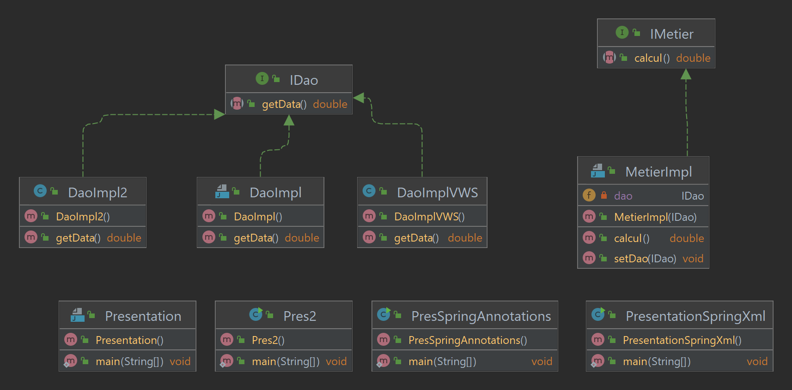
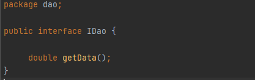
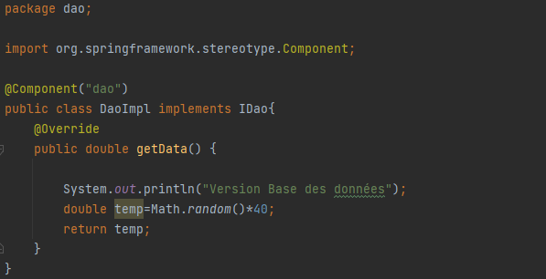
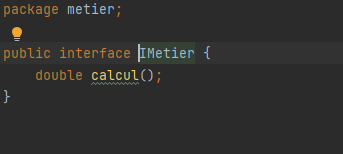
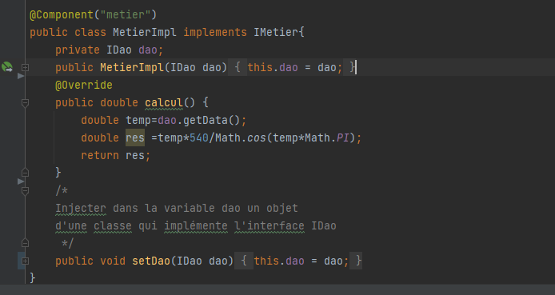
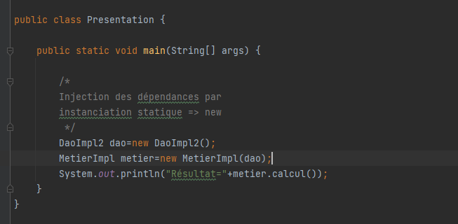
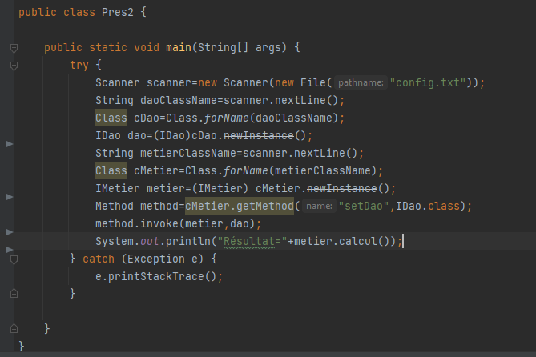
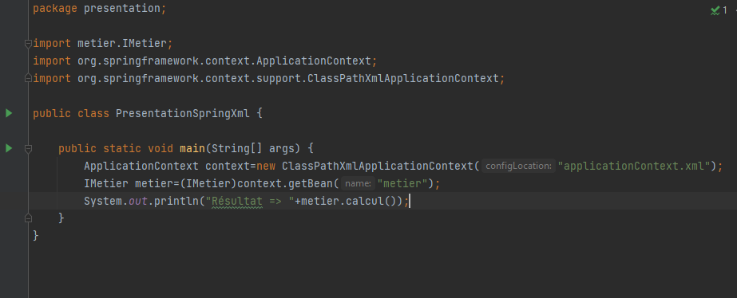
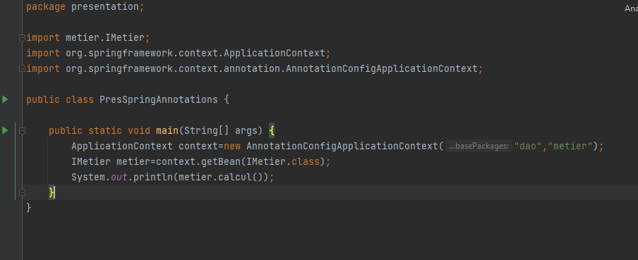

<h2>Table de matière</h2>
<ul>
    <li><a href="#dao">Couche Dao</a> 
        <ul><li><a href="#idao">Interface IDao</a></li>
        <li><a href="#impldao">Class DaoImpl</a></li></ul>
    </li>
   
<li><a href="metier">Couche metier</a>
        <ul><li><a href="imetier">Interface IMetier</a></li>
        <li><a href="implmetier">Class MetierImpl</a></li></ul>
 </li>
<li><a href="#pres">Couche presentation</a>
        <ul><li><a href="#pres1">Class Presentation</a></li>
        <li><a href="#pres2">Class Pres2</a></li>
        <li><a href="#presxml">Class PresntationSpringXml</a></li>
        <li><a href="#presanno">Class PresSpringAnnotations</a></li></ul>
    </li>
    <li><a href="ext">Couche ext</a>
        <ul><li><a href="impl2">Class DaoImpl2</a></li>
        <li><a href="implvws">Class DaoImplVWS</a></li></ul>
</li></ul>

<h2>Injection des dépendances et inversion de controle</h2>

<h2 id="dao">Couche Dao</h2>
<h3 id="idao">Interface IDao</h3>

<h3 id="impldao">Class DaoImpl</h3>

<h2 id="metier">Couche Metier</h2>
<h3 id="imetier">Interface IMetier</h3>

<h3 id="implmetier">Class MetierImpl</h3>

<h2 id="pres">Couche Presentation</h2>
<h3 id="pres1">Presentation</h3>

<h3 id="pres2">Presentation 2</h3>

<h3 id="presxml">Presentation Spring Xml</h3>

<h3 id="presanno">Presentation Annotations</h3>

